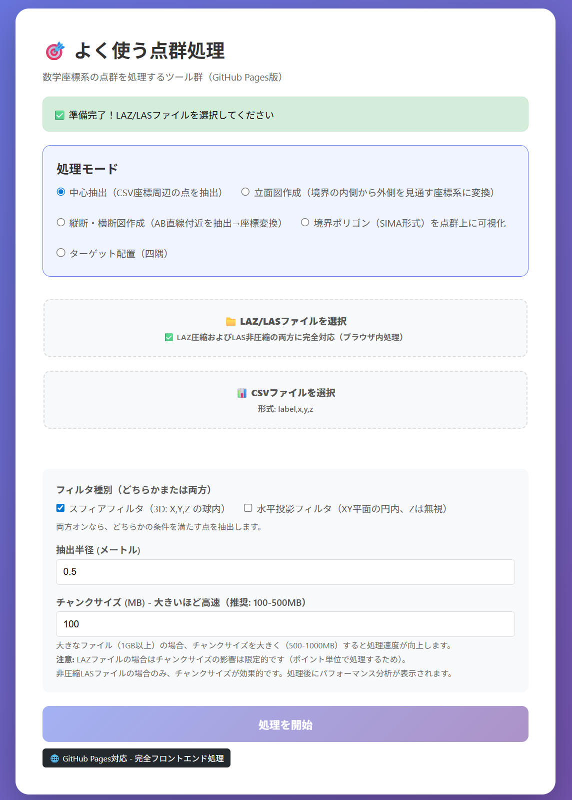

# よく使う点群処理

LAZ/LAS 点群をブラウザ内で処理するツール群。中心抽出・立面図・縦断・横断図・境界ポリゴン可視化・四隅ターゲット配置など。**サーバー不要・完全フロントエンド処理**

---

## 🌐 ライブデモ（GitHub Pages）

**👉 [https://yoshida088603.github.io/yokutsukau_pointcloud/](https://yoshida088603.github.io/yokutsukau_pointcloud/)**

サーバー不要でブラウザ上でLAZ/LASを処理できます。1GB以上のファイルも対応可能



---

## 🎯 検証主題

**ブラウザ内で完結するオフライン処理の検証**

- ✅ **LAZ圧縮対応**（laz-perf WASM）
- ✅ **オフライン処理**（データは外部に送信されず、処理中はネット不要）
- ✅ **静的ホスティングのみ**（GitHub Pagesで動作）
- ✅ **ストリーミング処理**　（1GBを超える大容量ファイルに対応

laz-perf WASMを統合し、LAZ/LAS処理がブラウザ内オフラインで完結することを検証・実現しています。

---

## 🎯 できること

- **LAZ / 非圧縮LAS** の両対応（laz-perf WASM）
- **中心抽出**: CSV座標周辺の点を指定半径で一括抽出（スフィア／水平投影フィルタ）
- **立面図作成**: 境界の内側→外側を見通す座標系に変換（A-B 2点指定、スフィア追加）
- **縦断・横断図**: AB直線付近を切り抜き、座標変換して出力
- **境界ポリゴン（SIMA）**: 画地SIMAを点群上に幅指定の帯として可視化（内側・帯・外側で Classification 分け）
- **ターゲット配置（四隅）**: 点群範囲の四隅に白黒チェッカーを追加し、中心座標をコピー用で表示
- リアルタイム進捗表示・処理後のパフォーマンス表示

---

## 📦 ローカルでの起動と GitHub Pages での公開

※アプリの操作（ファイル選択→実行→ダウンロード）はライブデモでそのまま試せます。以下は開発・検証用の起動・公開手順です。

### ローカルで試す

```bash
python -m http.server 8000
# ブラウザで http://localhost:8000/index.html
```

### GitHub Pagesで公開する

1. ルートに `index.html`（ブラウザ完結版）を配置済み。`app_github_pages.js` をアップロード
2. GitHub Pages を有効化
3. `https://<username>.github.io/yokutsukau_pointcloud/` でアクセス

**⚠️ 注意**: 必ずルート（`/` または `index.html`）を開いてください。`/variants/index.html` はサーバー版用のため、GitHub Pages では API がなく `Failed to fetch` になります。

### アーキテクチャ

| 役割 | 内容 |
|------|------|
| ブラウザUI | ファイル選択・進捗表示・ダウンロード |
| laz-perf WASM | ブラウザ内でLAZ解凍（CDN経由） |
| 処理 | 完全クライアント側。データは外部に送信されません |

### パフォーマンスの目安

- LASはチャンクサイズを大きく（500–1000MB）すると処理が速くなりやすい
- LAZはポイント単位処理のため、チャンクサイズの効果は限定的（非圧縮LASでのみ効果あり？）

詳細は [docs/GITHUB_PAGES.md](docs/GITHUB_PAGES.md) を参照。

---

## 🎨 スフィア点群のマゼンタ（RGB）について

LASのRGBは一般に **16bit（0–65535）** で格納されます。ビューアによっては表示時に 8bit に落とす際、上位8bit（例: `value >> 8`）を参照するため、
スフィア点に **8bit相当の 255（0x00FF）** を入れると **0（黒）に見える**ことがあります。

本ツールのスフィア点群は、確実にマゼンタ表示されるよう **16bitフルレンジ**で出力します。

- **Magenta（スフィア）**: `R=65535, G=0, B=65535`

（元点群にRGBが無い場合でも、スフィアを含む出力ではRGB付き（Point Format 2相当）で書き出します。）

## 📊 入力ファイル形式（CSV）

中心座標のCSVは次の形式です。

```csv
label,x,y,z
T1,-4921.472,-42414.329,8.650
T2,-4922.123,-42415.456,8.720
```

- 1行目: ヘッダー（`label,x,y,z` または `label,Y,X,Z`）
- 2行目以降: ラベル, X, Y, Z

---

## 📚 技術詳細

### LAZについて

LAZ（LASzip）はLAS点群の可逆圧縮形式で、おおよそ5–10倍の圧縮率です。

### ブラウザでLAZを扱うときの課題

- LAZ解凍にはWASMなどによる高速実装が必要
- ブラウザのメモリ制限（おおよそ2–4GB）
- laz-perf などWASMビルドの利用が必要

### laz-perfを選んだ理由

- **ビルド不要**: npm/CDNから利用可能
- **セットアップが簡単**: `import` で利用
- **静的ホスティング向き**: GitHub Pagesでそのままデプロイ可能
- **実績**: Potreeで利用されている
- **軽量**: 約1.2MB

**LAStools.jsを採用しなかった理由**: ビルド（CMake + Emscripten）が必要で、npm/CDNでの配布が確認できなかったため。

詳細: [docs/WASM_INTEGRATION.md](docs/WASM_INTEGRATION.md)

---

## 🔬 今後の検証テーマ

- [ ] **LAStools.jsとのパフォーマンス比較**
  - 同一ファイルでの処理時間・メモリ・ブラウザ互換性の評価

---

## 📝 ライセンス

MIT License

---

## 🔗 参考リンク

- [LASzip](https://laszip.org/) - LAZ圧縮仕様
- [laspy](https://github.com/laspy/laspy) - Python LAS/LAZライブラリ
- [laz-perf](https://github.com/hobu/laz-perf) - 高速LAZ解凍
- [Potree](https://github.com/potree/potree) - WebGL点群ビューワー
- [Emscripten](https://emscripten.org/) - C/C++ to WebAssembly
